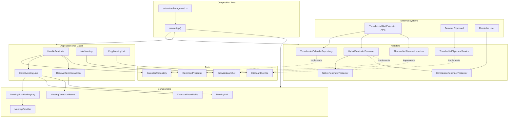

# Meeting Reminder Join

Meeting Reminder Join is a Thunderbird MailExtension that adds meeting-aware actions to calendar reminders. When a reminder fires, the extension reads the event's location and description/body fields, detects supported meeting links, and presents a **Join Meeting** action with **Copy Link** support.

The extension is read-only with respect to calendars: it never creates, edits, deletes, accepts, declines, or otherwise modifies calendar events or invitations. If a reminder does not contain a supported meeting link, the extension stays out of the way.

## Project Overview

This project is part of the Thunderbird Meeting Toolkit and focuses on one narrow workflow: joining online meetings from calendar reminders. The implementation uses TypeScript, Thunderbird MailExtension APIs, a bundled background script, and a companion reminder window for the current v1 UI.

The reminder presentation is intentionally hybrid:

- Native reminder UI is preferred when Thunderbird exposes a stable API for extending reminder rows.
- The companion window is the fallback when native presentation is unavailable.
- In v1, `NativeReminderPresenter.canPresent()` returns `false`, so supported meeting reminders use the companion window.

## Features

- Detects meeting links in calendar event location and description/body text.
- Shows Join and Copy actions only when a supported meeting link exists.
- Supports multiple detected links by choosing a primary link and preserving alternatives.
- Opens meeting URLs through a Thunderbird browser-launching adapter.
- Copies meeting URLs through the clipboard adapter.
- Keeps provider detection in plugins so new providers do not require core parser changes.
- Keeps domain and application logic independent from Thunderbird APIs.
- Packages as a loadable Thunderbird extension directory and `.xpi` file.

## Supported Meeting Providers

The default provider registry ships with detectors for:

- Zoom
- Microsoft Teams
- Google Meet
- Cisco Webex
- GoTo Meeting
- Slack
- Discord
- Jitsi Meet

Provider support lives in `src/domain/providers/`. The default set is exported from `createDefaultProviders()` in `src/domain/providers/index.ts`.

## Architecture Diagram



## Clean Architecture

The code follows Clean Architecture by keeping policy and business rules inside the domain and application layers, while Thunderbird-specific details remain outside the core.

- `src/domain/` contains meeting concepts: providers, links, URL extraction, registries, and detection results.
- `src/application/` contains use cases such as detecting a link, resolving a reminder action, joining a meeting, copying a link, and handling a reminder.
- `src/ports/` defines interfaces that the application needs but does not implement.
- `src/adapters/` implements those ports for Thunderbird or test fakes.
- `src/composition/root.ts` wires concrete adapters to use cases.
- `src/extension/` contains the MailExtension entry points and static extension assets.

The domain and application layers do not import `browser.*`, `messenger.*`, or other Thunderbird runtime APIs. That keeps most behavior testable with Vitest without launching Thunderbird.

## Hexagonal Architecture

The project also uses Hexagonal Architecture, where the application core is surrounded by ports and adapters.

Inbound activity starts at `src/extension/background.ts`, which listens for reminder-related runtime messages and known Thunderbird reminder listener shapes. The background script delegates to `HandleReminder` through the composition root.

Outbound behavior goes through ports:

- `CalendarRepository` reads calendar event fields.
- `ReminderPresenter` presents or hides reminder UI.
- `BrowserLauncher` opens the selected meeting URL.
- `ClipboardService` writes the selected URL to the clipboard.

Thunderbird is one adapter set around these ports. Tests use fake adapters, which lets the application behavior be verified without Thunderbird.

## Folder Structure

```text
src/
  adapters/
    fake/                  Test doubles for ports
    thunderbird/           Thunderbird MailExtension adapters
  application/             Reminder and action use cases
  composition/             createApp() dependency wiring
  domain/                  Provider registry, meeting links, URL extraction
    providers/             One detector module per supported provider
  extension/               Manifest, background entry, companion UI, icons
tests/
  adapters/                Adapter behavior tests
  application/             Use-case tests
  domain/                  Domain model and URL extraction tests
  providers/               Provider detector tests
scripts/
  install-in-thunderbird.sh Builds and registers the add-on in a Thunderbird profile
  package-xpi.mjs          Builds dist/meeting-reminder-join-<version>.xpi
docs/
  superpowers/specs/       Design and implementation planning notes
dist/
  extension/               Generated loadable extension output
```

Key files:

- `src/extension/manifest.json` declares the Thunderbird extension metadata and permissions.
- `src/extension/background.ts` is the extension runtime entry point.
- `src/extension/companion/` contains the fallback reminder window UI.
- `scripts/install-in-thunderbird.sh` installs the built add-on into a local Thunderbird profile.
- `esbuild.config.mjs` bundles TypeScript and copies static extension assets into `dist/extension/`.
- `package.json` defines test, typecheck, build, package, and install scripts.

## Thunderbird Setup

### Requirements

| Requirement | Notes |
| --- | --- |
| Thunderbird **128+** (ESR recommended) | Manifest `strict_min_version` is `128.0` |
| Node.js **20+** | Needed to install deps and build the extension |
| A calendar with events you can remind | Local or remote calendar is fine |

This extension is **read-only**: it never creates or changes calendar events. A disposable Thunderbird profile is still useful while iterating, so a broken temporary add-on load does not affect your daily mail profile.

### Create or use a test profile (optional)

```bash
# macOS / Linux example — opens the profile manager
thunderbird -P
```

Create a profile such as `meeting-join-dev`, then continue setup in that profile.

### One-time developer setup

From the repository root:

```bash
npm install --ignore-scripts
npm test
npm run build
npm run install:thunderbird
```

That builds `dist/extension/` and registers it in your Thunderbird profile. See [Install in Thunderbird](#install-in-thunderbird) for temporary loading and other options.

## Local Development

Quick start from the repository root:

```bash
npm install --ignore-scripts
npm test
npm run build
```

Install dependencies with lifecycle scripts disabled. The repository also includes `.npmrc` with `ignore-scripts=true`, so future installs skip package lifecycle scripts by default even without the CLI flag. Keep that setting in place.

## Build Instructions

Build the loadable extension directory:

```bash
npm run build
```

The build writes bundled scripts, source maps, the manifest, companion assets, and icons to `dist/extension/`.

After any code change, rebuild, then **reload** the temporary add-on in Thunderbird (see below). Thunderbird does not pick up `dist/` changes automatically.

## Install in Thunderbird

There are two supported local install paths:

1. **Setup script (recommended for day-to-day local use)** — builds the add-on and registers it in a Thunderbird profile via a developer proxy file.
2. **Temporary add-on** — load once through `about:debugging` (cleared when Thunderbird quits).

### Option A — Setup / install script

From the repository root:

```bash
chmod +x scripts/install-in-thunderbird.sh   # once
npm run install:thunderbird
```

Or call the script directly:

```bash
./scripts/install-in-thunderbird.sh
./scripts/install-in-thunderbird.sh --list-profiles
./scripts/install-in-thunderbird.sh --profile dbexqcex.default-esr --launch
./scripts/install-in-thunderbird.sh --uninstall
```

What the script does:

1. Runs `npm install --ignore-scripts` if `node_modules` is missing.
2. Builds into `dist/extension/`.
3. Selects a Thunderbird profile (prefers `*.default-esr`, or use `--profile`).
4. Writes a proxy file under `<profile>/extensions/meeting-reminder-join@thunderbird-meeting-toolkit.local` that points at `dist/extension/`.
5. Appends `xpinstall.signatures.required=false` to that profile’s `user.js` when needed so a local unsigned MailExtension can load.
6. With `--launch`, starts Thunderbird for that profile.

Then **fully quit and restart Thunderbird** (unless you used `--launch` on a stopped instance) and confirm **Meeting Reminder Join** under **Tools → Add-ons and Themes**.

After code changes:

```bash
npm run build
```

Restart Thunderbird (or disable/enable the add-on) so it reloads `dist/extension/`.

Uninstall the proxy registration:

```bash
npm run uninstall:thunderbird
# or: ./scripts/install-in-thunderbird.sh --uninstall --profile <name>
```

> Note: Thunderbird cannot always be force-installed while a signed-only policy is active. If the add-on is blocked, use Option B (temporary load) or check `xpinstall.signatures.required` in `about:config`.

### Option B — Temporary add-on

Temporary installation is ideal for a one-off smoke test. Temporary add-ons are removed when Thunderbird quits; load them again after each restart.

#### 1. Build

```bash
npm run build
```

Confirm these files exist:

```text
dist/extension/manifest.json
dist/extension/background.js
dist/extension/companion/companion.html
dist/extension/icons/icon-48.png
```

#### 2. Open add-on debugging

1. Start Thunderbird 128+.
2. In the address/URL bar, open:

   ```text
   about:debugging#/runtime/this-firefox
   ```

   In Thunderbird this page is labeled **This Thunderbird**.

   Alternate path: **Tools → Add-ons and Themes** is for installed add-ons; temporary loading uses **about:debugging**, not the normal Add-ons Manager install flow.

#### 3. Load the extension

1. On the left, select **This Thunderbird**.
2. Under **Temporary Extensions**, click **Load Temporary Add-on…**.
3. Browse to the repo’s build output and select:

   ```text
   dist/extension/manifest.json
   ```

   Select the **manifest file**, not a parent folder and not the `.xpi` (unless you are using the packaged install path below).

4. Confirm **Meeting Reminder Join** appears under Temporary Extensions.

After loading, Thunderbird runs `dist/extension/background.js`. Use **Inspect** next to the extension to open the background console for logs and errors.

#### 4. Reload after rebuilds

When you change source and rebuild:

1. Run `npm run build` again.
2. In `about:debugging`, find **Meeting Reminder Join**.
3. Click **Reload**.

If Reload is unavailable or the UI looks stale, remove the temporary add-on and **Load Temporary Add-on…** again pointing at `dist/extension/manifest.json`.

#### 5. Smoke-test a reminder

1. Create a calendar event whose **Location** (or description) contains a supported link, for example:

   ```text
   https://meet.google.com/abc-defg-hij
   ```

2. Set a reminder for about one minute from now.
3. When the reminder fires, the companion window should show **Join Meeting**, **Copy**, and **Dismiss** if a link was detected.
4. Events with no meeting URL should show no extension UI.

If the companion never appears when a link is present, see [Troubleshooting](#troubleshooting) and [Debugging](#debugging). Thunderbird calendar reminder listeners vary by version; the background script also accepts a development `handle-reminder` runtime message with an `eventId`.

## Packaging

Create a versioned `.xpi` package:

```bash
npm run package
```

The package script runs the build and then writes:

```text
dist/meeting-reminder-join-0.1.0.xpi
```

The version comes from `package.json`.

### Install from the `.xpi` (optional)

For a packaged trial (still not AMO-signed):

1. Run `npm run package`.
2. In Thunderbird open `about:addons` (**Tools → Add-ons and Themes**).
3. Use the gear menu → **Install Add-on From File…**.
4. Choose `dist/meeting-reminder-join-0.1.0.xpi`.

Unsigned / self-built `.xpi` installs may be blocked depending on Thunderbird channel and preferences. Prefer **Load Temporary Add-on** during development. Distribution through [addons.thunderbird.net](https://addons.thunderbird.net/) is required for normal end-user installs.

## Running Tests

Run the unit test suite:

```bash
npm test
```

Run TypeScript checking:

```bash
npm run typecheck
```

Run the full local verification sequence:

```bash
npm test && npm run typecheck && npm run build && npm run package
```

## Debugging

Use Thunderbird's add-on debugging tools:

1. Open `about:debugging`.
2. Choose **This Thunderbird**.
3. Find **Meeting Reminder Join**.
4. Open the background page or background console from **Debug**.
5. Watch for reminder listener logs, runtime message failures, browser launch failures, and clipboard failures.

The background script logs and reports non-blocking failures so Thunderbird's own reminder behavior is not blocked. Browser launch and clipboard failures can also produce Thunderbird notifications when the notification API is available.

## Adding A New Meeting Provider

Add providers as plugins. Do not change the core parser for provider-specific behavior.

1. Create a new module in `src/domain/providers/`.
2. Implement the `MeetingProvider` interface:
   - `id`
   - `displayName`
   - `icon`
   - `detectionPatterns`
   - `validate(url)`
   - `normalize(url)`
3. Export the provider from `src/domain/providers/index.ts`.
4. Add it to `createDefaultProviders()`.
5. Add provider tests in `tests/providers/`.
6. Add registry or detection coverage if the provider introduces a new edge case.

The parser asks `MeetingProviderRegistry` to match URLs against registered providers. A new provider should not require changes to `DetectMeetingLink`, `extract-urls`, or application use cases.

## Extending The Provider Registry

`MeetingProviderRegistry` accepts a provider list in its constructor. The default application composition uses:

```ts
const registry = new MeetingProviderRegistry(createDefaultProviders());
```

To extend registry behavior, prefer changes that preserve the existing contract:

- Register providers in priority order when first-match behavior matters.
- Keep `getById()` stable for action payloads and UI labels.
- Keep `list()` read-only from callers' perspective.
- Keep `matchUrl()` responsible for provider pattern matching, validation, and normalization.
- Add focused tests for any new registry behavior.

If future preferences allow custom or enterprise providers, compose those providers before constructing `MeetingProviderRegistry` rather than adding Thunderbird concerns to the domain registry.

## Troubleshooting

No Join button appears:

- The reminder may not contain a supported meeting link.
- Check the event location and description/body for a URL supported by the default providers.
- Unknown, malformed, or unsupported URLs are ignored.

The companion window always appears:

- This is expected in v1. `NativeReminderPresenter.canPresent()` returns `false` because Thunderbird 128 does not expose a stable MailExtension API for extending the native calendar reminder row.
- The hybrid presenter falls back to `CompanionReminderPresenter` when native presentation is unavailable.

Copy Link does not work:

- Confirm the extension has the `clipboardWrite` permission.
- Check the background console for clipboard errors.
- Some clipboard operations may depend on Thunderbird/runtime context.

Join opens inside Thunderbird instead of the default browser:

- Confirm the running Thunderbird version exposes `browser.windows.openDefaultBrowser` or `messenger.windows.openDefaultBrowser`.
- When that API is unavailable, the launcher falls back to `tabs.create` so the Join action still opens the meeting URL.

The companion window does not open:

- Confirm the extension has the `windows` permission.
- Check that `browser.windows.create` or `messenger.windows.create` is available in the running Thunderbird version.
- Rebuild and reload the temporary add-on after manifest changes.

Calendar reminders do not trigger the Join window:

- Thunderbird does **not** ship a built-in MailExtension reminder event. This add-on bundles Thunderbird’s draft **calendar experiment API** (`calendar.items`) and also runs a **ReminderWatcher** poll via `browser.alarms` because MV3 background pages can sleep and drop live `onAlarm` observers.
- Required permissions: `alarms`, `tabs`, `clipboardWrite`, `notifications`. (`browser.windows` is available in Thunderbird without a separate `windows` permission — that permission string is invalid in MailExtensions.)
- If an older install cached bad permissions, run `npm run install:thunderbird` with Thunderbird fully quit so `extensions.json` is refreshed.
- After installing or updating, **fully quit and restart Thunderbird** so experiment APIs and permissions load.
- In `about:debugging` → **Meeting Reminder Join** → **Inspect**, the background console should log:
  - `hasCalendarItemsQuery: true`
  - `hasAlarms: true`
  - `ReminderWatcher started`
  - periodic `ReminderWatcher poll complete`
- If `hasAlarms` is false, remove the add-on, reinstall, and restart.
- The native Thunderbird reminder dialog will still appear; the companion Join window is an additional surface when a meeting link is detected.
- Events must have a reminder/alarm configured (or a VALARM / start-15m fallback), and the Location or Description must contain a supported meeting URL.

## Manual Smoke Checklist

Follow [Install in Thunderbird (temporary add-on)](#install-in-thunderbird-temporary-add-on), then:

- Create or use a test calendar event with a supported meeting link, such as Google Meet or Zoom.
- Trigger the reminder or development reminder hook.
- Confirm the companion reminder shows Join and Copy actions.
- Confirm Join opens the meeting URL in the default browser.
- Confirm Copy writes the meeting URL to the clipboard.
- Test an event with no meeting link and confirm no extension UI appears.
- Rebuild, run `npm run package`, and confirm the versioned `.xpi` exists in `dist/`.

## Future Roadmap

- Preferences for provider enablement, UI behavior, and forcing companion mode.
- More built-in providers, including enterprise and self-hosted meeting systems.
- Custom provider registration when a preferences UI exists.
- Native reminder-row injection if Thunderbird exposes stable MailExtension APIs for it.
- Richer multi-link selection and provider display metadata.
- Broader manual and automated coverage against real Thunderbird reminder API behavior.
